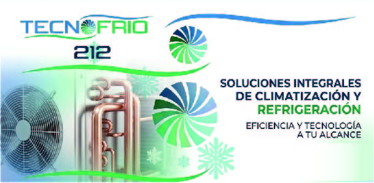

# ❄️ Tecno Frío 212

> **Sitio web profesional para Tecno Frío 212 - Soluciones integrales de climatización y refrigeración en Venezuela**

## 📋 Descripción

Sitio web corporativo para una empresa especializada en la venta e instalación de aires acondicionados, compresores, refrigerantes y accesorios para climatización residencial e industrial.

### 🎯 Características principales

- ✅ **Diseño responsive** - Adaptado a todos los dispositivos
- ✅ **Hero interactivo** - Con efectos parallax y animaciones
- ✅ **Galería de productos** - Filtro por categorías (Compresores, Refrigerantes, Accesorios)
- ✅ **Sección de asesores** - Contacto directo por WhatsApp y email
- ✅ **Mapa integrado** - Ubicación física con Google Maps
- ✅ **Optimizado SEO** - Meta tags y estructura semántica
- ✅ **Rendimiento optimizado** - Lazy loading y animaciones suaves

## 🛠️ Tecnologías utilizadas

| Tecnología | Uso |
|------------|-----|
| **HTML5** | Estructura semántica del sitio |
| **CSS3** | Estilos personalizados, animaciones, grid/flexbox |
| **JavaScript** | Interactividad, filtros, efectos scroll |
| **Font Awesome** | Iconografía profesional |
| **Google Fonts** | Tipografías Outfit y DM Sans |
| **Cloudflare Pages** | Hosting gratuito con CDN global |

